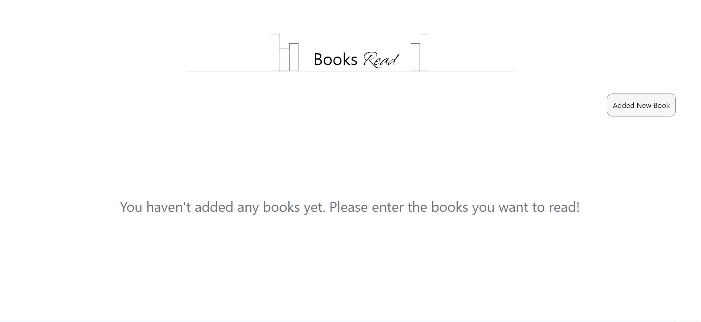

## BookTracker-Frontend

This project is written as a frontend for the BookTracker backend application. Users can perform CRUD operations on the added books by adding a book.

## Project Outcome


[BookTracker Live Page](https://book-tracker-frontend-five.vercel.app/)

## Tech/framework used

- **axios**
  Axios is a JavaScript library used for making HTTP requests. It can work in both browsers and Node.js environments and provides a Promise-based API.

- **React**
  is a JavaScript library developed by Facebook. It is used to build user interface components and is a popular choice for developing single-page applications.

- **Tailwind CSS**
  Tailwind CSS is a utility-first CSS framework for creating custom designs quickly. It allows for rapid development by providing a set of pre-defined utility classes that can be used to style HTML elements.

- **React Icons** is used to include icons in React applications. It includes various icon sets and can be easily used through components.
- **Context API**
  Context API is a feature in React that allows components to share data without having to pass props manually at every level of the component tree. It provides a way to share state between components without using props drilling.
- **React Toastify**
  React Toastify is a library for displaying notifications in React applications. It provides a simple way to show success, error, and other types of notifications to users.

## Getting Started

This is an example of how you may give instructions on setting up your project locally.
To get a local copy up and running follow these simple example steps.

### Prerequisites

This is an example of how to list things you need to use the software and how to install them.

- npm
  ```sh
  npm install npm@latest -g
  ```

### Installation

_Below is an example of how you can instruct your audience on installing and setting up your app. This template doesn't rely on any external dependencies or services._

1. Clone the repo
   ```sh
   git clone https://github.com/esmaaksoy/bookTracker-frontend
   ```
2. Install NPM packages
   ```sh
   npm install
   ```
3. The project is ready, you can start using it now.
   You can run:

   `npm start`

   Runs the app in the development mode.\
   Open [http://localhost:3000](http://localhost:3000) to view it in the browser.
